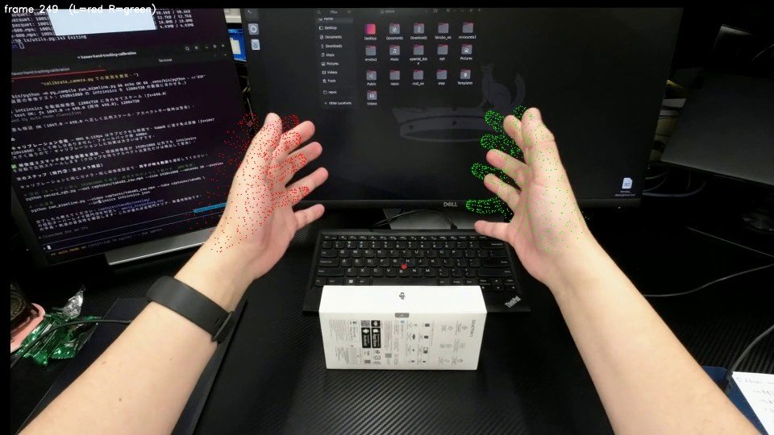
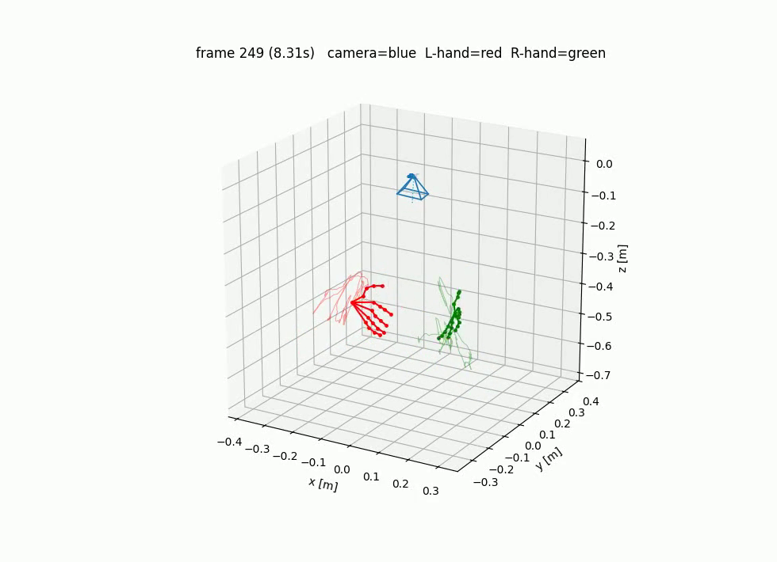

# human_hand_video_to_vla_dataset

RGB 単眼動画から**両手・指（各21関節×2手）の world 座標軌道**を推定するパイプラインです。
[HaWoR](https://github.com/ThunderVVV/HaWoR)（CVPR 2025）をベースに、カメラキャリブレーションから
推定実行・検証用可視化・npz 形式でのエクスポートまでを一括で行います。

<p align="center">
  
  
</p>
<p align="center">
  <em>左: 推定メッシュの投影オーバーレイ（左手=赤・右手=緑） / 右: world 座標の 3D 軌道（カメラ姿勢 + 両手スケルトン）</em>
</p>

## 特徴

- mp4 動画を入力すると、world 座標の両手 21 関節軌道（npz）を出力
- チェスボードによるカメラキャリブレーション（盤面パターンの自動検出付き）
- 検証用の可視化を自動生成（メッシュ投影オーバーレイ動画・3D スケルトン動画）
- Python ライブラリ（`handtraj` パッケージ）としても利用可能

## HaWoR との関係

HaWoR は手の world 軌道の**推定エンジン**であり、本システムはそれを**データセット作成に
実用できる形へ整備した周辺一式**です。推定アルゴリズム自体（検出・MANO 回帰・SLAM・
スケール推定）は HaWoR を無改造で使用しており、推定精度は HaWoR の性能に準じます。

|  | HaWoR 単体 | 本システム |
|---|---|---|
| 出力 | 可視化動画のみ（座標データのファイル出力なし） | 文書化された npz（関節座標・有効フラグ・スケール係数） |
| カメラパラメータ | 焦点距離を手動指定（未指定だと 600px 仮定） | キャリブレーションツール同梱・歪み/主点の前処理込みで自動連携 |
| 結果の検証 | 手段なし | 投影オーバーレイ動画・手のサイズの妥当性チェックを自動生成 |
| 動作環境 | torch 1.13 世代（最新 GPU / torch 2.x ではビルド不可） | 最新環境向けパッチと検証済み依存関係を同梱 |
| 使い方 | 研究用スクリプト | 一括 CLI + Python ライブラリ API |

## 動作環境

- Ubuntu 24.04 / Python 3.12
- NVIDIA GPU（開発・検証環境は RTX 5080 / CUDA 12.x）
- PyTorch 2.7.1（cu128）
- ffmpeg

## ディレクトリ構成

```
handtraj/    ライブラリ本体
scripts/     コマンドラインスクリプト
tools/       補助ツール（HaWoR 推論ドライバ・可視化・MANO 変換など）
adapters/    HaWoR 出力アダプタ（互換用の再エクスポート）
legacy/      旧 RealSense D405（深度カメラ）版のスクリプト（現在未使用）
patches/     HaWoR 側ソースへの必須パッチと適用スクリプト
third_party/ HaWoR のクローン先（リポジトリには含まれません）
captures/    録画・推定結果の置き場（リポジトリには含まれません）
```

## セットアップ

```bash
python3.12 -m venv .venv && source .venv/bin/activate

# 1) 依存パッケージ
pip install -r requirements.txt
pip install torch==2.7.1 torchvision==0.22.1 --index-url https://download.pytorch.org/whl/cu128
pip install -r requirements_hawor_cu128.txt
pip install pytorch-lightning==2.2.4 --no-deps && pip install lightning-utilities torchmetrics==1.4.0
pip install torch-scatter==2.1.2 -f https://data.pyg.org/whl/torch-2.7.0+cu128.html

# 2) HaWoR の取得とパッチ適用（パッチ内容は patches/apply_patches.sh のコメント参照）
git clone --recursive https://github.com/ThunderVVV/HaWoR.git third_party/HaWoR
bash patches/apply_patches.sh

# 3) CUDA 拡張のビルド
export TORCH_CUDA_ARCH_LIST="12.0" FORCE_CUDA=1 CUDA_HOME=/usr/local/cuda-12   # GPU に合わせて変更
cd third_party/HaWoR/thirdparty/DROID-SLAM && python setup.py install && cd -
pip install --no-build-isolation "git+https://github.com/facebookresearch/pytorch3d.git@stable"

# 4) HaWoR の学習済み重みを third_party/HaWoR/ 配下に配置（HaWoR の README 参照）
#    droid.pth / Metric3D / WiLoR detector.pt / hawor.ckpt / infiller.pt

# 5) MANO モデル（https://mano.is.tue.mpg.de で要アカウント登録）
python tools/prepare_mano.py --mano_zip ~/Downloads/mano_v1_2.zip
#    ※ 公式 pkl は直接配置せず必ずこのツールで変換してください（Python 3.12 では読めないため）
```

## 使い方

```bash
# 0) 一度だけ（推奨）: カメラキャリブレーション
#    チェスボードをいろいろな角度・距離で 20 秒ほど撮影した動画を用意して:
python scripts/calibrate_camera.py --video calib.mp4 --out intrinsics.json

# 1) 録画（UVC/Web カメラ）。既存の mp4 をそのまま使うこともできます
python scripts/record_rgb.py --out captures/take01_raw.mp4 --seconds 20 --preview

# 2) 推定パイプラインの実行
python scripts/run_pipeline.py --video captures/take01_raw.mp4 --take captures/take01 \
                               --intrinsics intrinsics.json
```

実行が終わると `captures/take01/` に以下が生成されます。

| ファイル | 内容 |
|---|---|
| `world_trajectory.npz` | 最終出力（下記「出力形式」参照） |
| `overlay/overlay.mp4` ほか | メッシュ投影オーバーレイ（推定品質の目視確認用） |
| `vis3d/world_3d.mp4` | 3D 可視化（カメラ軌跡 + 両手スケルトン） |

- `--intrinsics` を省略しても動作しますが、焦点距離が既定値（600px）にフォールバックし精度が落ちます。
- オプション: `--skip_overlay` / `--skip_vis3d`（可視化の省略）、`--force`（再実行）、
  `--no_rectify`（歪み補正・主点センタリングの前処理を無効化）

### ライブラリとして使う

`handtraj` パッケージを import すると、コマンドラインと同じ処理を Python から実行できます。

#### 1. 動画から推定結果まで（一括実行）

```python
from handtraj import Pipeline, PipelineConfig

cfg = PipelineConfig(
    take="captures/take01",        # 成果物の出力ディレクトリ
    video="path/to/input.mp4",     # 入力動画
    intrinsics="intrinsics.json",  # カメラ内部パラメータ（省略可・推奨）
    # force=True,                  # 生成済みでも再実行
    # skip_overlay=True,           # オーバーレイ動画を生成しない
    # skip_vis3d=True,             # 3D 可視化動画を生成しない
)
Pipeline(cfg).run()
# 完了後の生成物:
#   captures/take01/world_trajectory.npz   推定結果（軌道データ）
#   captures/take01/overlay/overlay.mp4    メッシュ投影オーバーレイ
#   captures/take01/vis3d/world_3d.mp4     3D 可視化
```

処理済みの成果物があるステージは自動でスキップされるため、同じ `take` を再実行しても
HaWoR の推論からやり直しにはなりません。

#### 2. 推定結果を読み込んで使う

```python
import numpy as np

data = np.load("captures/take01/world_trajectory.npz")
joints = data["joints"]            # [T, 2, 21, 3] world 座標 [m]（軸1: 0=左手, 1=右手）
valid = data["valid_per_hand"]     # [T, 2] 手ごとの有効フラグ

right_wrist = joints[:, 1, 0]      # 右手・手首の軌道 [T, 3]（関節0=手首）
right_index_tip = joints[:, 1, 8]  # 右手・人差し指先端の軌道 [T, 3]
ok = valid[:, 1]                   # 右手が検出できたフレームだけを使う
print(right_wrist[ok].shape)
```

#### 3. 中間結果への低レベルアクセス

パイプライン実行後の HaWoR 出力（`<take>/rgb/`）には `HaworSequence` でアクセスできます。
独自のエクスポートや解析を書くときの入口です。

```python
from handtraj import HaworSequence, TrajectoryExporter

seq = HaworSequence("captures/take01/rgb")
seq.joints_world   # [T, 2, 21, 3] world 座標の手関節（スケール係数適用前）
seq.verts_cam      # [T, 2, 778, 3] MANO メッシュ頂点（カメラ座標）
seq.valid          # [T, 2] 有効フラグ
seq.R_c2w          # [T, 3, 3] カメラ姿勢（camera→world 回転）
seq.cam_centers    # [T, 3]    カメラ位置（world 座標）

# npz 出力（スケール係数を差し替えたい場合は alpha を指定）
TrajectoryExporter(seq).export("out.npz", alpha=1.0)
```

#### 4. キャリブレーション・可視化を個別に使う

```python
from handtraj import CameraCalibrator, Intrinsics, OverlayRenderer, Skeleton3DRenderer

# チェスボード動画から内部パラメータを推定して保存
intr = CameraCalibrator().calibrate_video("calib.mp4")
intr.save("intrinsics.json")

# 推定済みシーケンスにオーバーレイ動画だけ作り直す
seq = HaworSequence("captures/take01/rgb")
renderer = OverlayRenderer(seq, Intrinsics.load("captures/take01/intrinsics.json"))
renderer.render_video("captures/take01/rgb.mp4", "overlay.mp4")

# 視点を変えて 3D 可視化を作り直す
import numpy as np
d = np.load("captures/take01/world_trajectory.npz")
Skeleton3DRenderer(d["joints"].astype(np.float64), d["valid_per_hand"],
                   seq.cam_centers * float(d["alpha"]), seq.R_c2w) \
    .render_video("world_3d.mp4", fps=30.0, elev=35, azim=-90)
```

## 出力形式（world_trajectory.npz）

| キー | 形状 | 内容 |
|---|---|---|
| `joints` | `[T, 2, 21, 3]` float32 | world 座標の手関節位置 [m]。軸1は [左手, 右手]。検出失敗フレームは NaN |
| `alpha` | スカラー | 適用済みグローバルスケール係数（既定 1.0） |
| `valid` | `[T]` bool | いずれかの手が有効なフレーム |
| `valid_per_hand` | `[T, 2]` bool | 手ごとの有効フラグ |

関節順序は OpenPose 互換（0=手首、1–4=親指、5–8=人差し指、9–12=中指、13–16=薬指、17–20=小指）。

## 精度に関する注意

- **スケールは近似メートル**です。実寸スケールは HaWoR 内蔵の単眼深度推定（Metric3D）に依存し、
  誤差 5〜15% 程度を見込んでください。較正値があれば
  `scripts/export_trajectory.py --alpha <値>` で差し替えられます。
- 画像面での手位置の整合は 1〜2cm 程度（モデル性能由来）。
- カメラの位置・回転ドリフトは未補正です。長時間の撮影では絶対位置の精度が低下します。

## ライセンスに関する注意

本リポジトリのコードは HaWoR（**CC BY-NC-ND 4.0**・非商用）と MANO（要登録・再配布不可）に
依存します。これらのモデル・重みはリポジトリに含まれないため、上記セットアップ手順に従って
各配布元のライセンスに同意のうえ取得してください。
